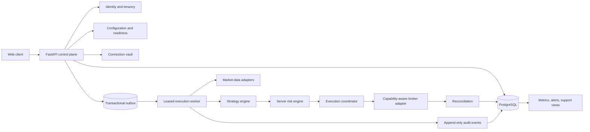
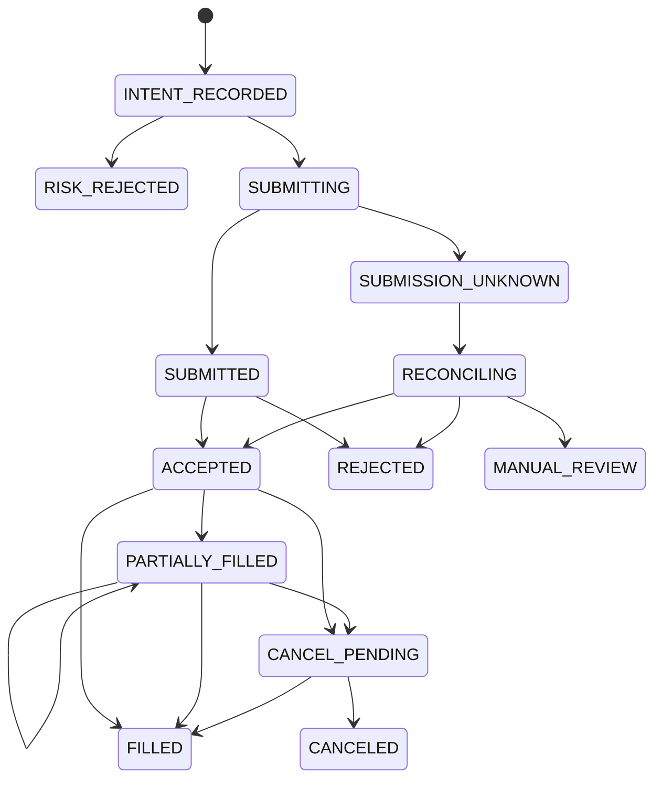

## Context

The current system is a FastAPI monolith with SQLAlchemy/Alembic persistence and a Vite/React client. HTTP routes directly coordinate authentication, integration adapters, paper execution, strategy evaluation, risk checks, reconciliation diagnostics, launch gates, onboarding, analytics, and demo data. P0 remediation moved request-rate buckets to the shared database, while bot-session state remains process-local and is still a release blocker. Durable tables cover users and sessions; security/operator audit events; rate limits; account deletion and provider-revocation attempts; encrypted platform integrations; paper orders, events, fills, positions, account snapshots, and ledger entries; risk decisions and kill switches; reconciliation evidence and account locks; strategy configs/signals; legal, invite, onboarding, support, analytics, and entitlement records.

Verified strengths include explicit paper-only rejection of live requests, user ownership filters on trading records, database-level paper-order idempotency per user, durable paper lifecycle records, server-side risk and kill-switch checks, stale strategy-data suppression, reconciliation locks, launch-gate evidence, and user-scoped demo seed/reset. The complete local suite passed 113 tests. The current design is nevertheless unsuitable for external beta because broker adapters are incomplete, provider support is overstated, execution workers are not durable, paper fills are immediate and simplistic, session tokens are stored in browser local storage, public registration is abusable, dependency advisories remain, Alembic ignores `DATABASE_URL`, operator audit and account export/deletion are missing, and hosted TopstepX automation conflicts with current official personal-device restrictions.

Stakeholders are beta users, product/support operators, security and infrastructure owners, broker/market-data partners, and qualified legal/compliance reviewers. The controlling constraints are: preserve existing demo/strategy behavior; never weaken paper/live, risk, kill-switch, or reconciliation gates; use only official authorized APIs; never infer a fill from submission; and default external beta to simulation or broker paper.

## Goals / Non-Goals

**Goals:**

- Make tenant, broker, account, instrument, strategy, environment, and execution identity explicit and durable.
- Support multiple providers through capability-aware adapters without erasing provider differences.
- Provide deterministic, idempotent order processing and reconciliation across retries and restarts.
- Put risk enforcement and emergency shutdown on the server-side execution boundary.
- Protect credentials through delegated authorization where possible and envelope encryption otherwise.
- Give users and operators complete, redacted traceability and visible degraded states.
- Establish objective simulation, broker-paper, and eventual live release gates.
- Permit incremental migration without breaking the working paper demo or `rsi-threshold-v1`.

**Non-Goals:**

- Enabling live trading in this change.
- Promising strategy profitability or treating backtests as forecasts.
- Integrating every broker, unsupported platform, or browser-only platform.
- Browser automation, credential scraping, shared user passwords, or unofficial APIs.
- Building high-frequency or sub-minute execution.
- Providing legal, tax, investment, or regulatory advice.

## Decisions

### 1. Modular monolith first, durable worker boundary

Keep FastAPI and the relational database, but separate identity, connection, configuration, market-data, strategy, risk, execution, reconciliation, audit, and operations modules behind typed service interfaces. Move active bot runs from process-global dictionaries into durable `bot_runs`, leases, checkpoints, and commands processed by a worker. A transactional outbox publishes work after database commit.

This avoids premature microservices while removing single-process correctness assumptions. A message broker is optional initially; PostgreSQL outbox and `SKIP LOCKED` leases are sufficient for a small beta. Alternative: retain in-memory bot state. Rejected because restarts and multiple workers can duplicate or lose work.

### 2. Tenant ownership is mandatory at every boundary

All user data carries `tenant_id` (initially equivalent to the user account, with room for organizations), and every repository method requires a tenant context. Database uniqueness keys include tenant and environment where appropriate. Administrative reads require a named role, purpose, case/reference ID, time-limited authorization, and an audit event. Automated isolation tests create two tenants for every sensitive route and worker command.

Alternative: rely on route-level `user_id` filters. Rejected because background jobs, joins, exports, analytics, and operator tooling can bypass route conventions.

### 3. Broker connections use delegated grants and a capability manifest

Prefer broker OAuth/authorization-code flows with PKCE and least-privilege scopes. Store refresh/access tokens only in a server-side vault using envelope encryption with a managed KMS/HSM key, per-record data keys, versioned ciphertext, and rotation state. For providers that only issue API keys, collect keys over TLS, never redisplay secrets, verify permissions, and support replacement/revocation. Never store broker passwords when an official delegated method exists.

Each adapter returns a versioned `CapabilityManifest`, including asset classes, account environments, auth modes, market-data entitlements, streaming channels, order types, time-in-force, fractional/short/option behavior, preview, cancel, replace, bracket/OCO support, client-order-id behavior, event ordering guarantees, rate limits, session windows, and regional/commercial restrictions. Configuration preflight rejects any unsupported combination before a bot run starts.

The canonical interface covers:

- `authorize`, `exchange_code`, `refresh`, `revoke`, and `connection_health`
- `list_accounts` and verified paper/live account environment
- `list_instruments`, `get_instrument`, sessions, tick/lot/value metadata
- `subscribe_market_data`, `historical_bars`, and `get_quote`
- `get_balances`, `get_positions`, and account/risk state
- `preview_order`, `submit_order`, `cancel_order`, and `replace_order`
- normalized order, fill, cancel, rejection, and connectivity events
- `snapshot_broker_state` and `reconcile`
- `capabilities` with explicit unsupported reasons

Alternative: a lowest-common-denominator interface. Rejected because it hides dangerous provider differences.

### 4. Initial provider scope is deliberately narrow

- Invite-only simulation: the existing local paper engine and fake demo integration, with no real broker credentials.
- First broker-paper candidates: Tradovate demo for futures and Alpaca paper for US equities/eligible crypto, only after commercial/API approval, OAuth or least-privilege key flow, streaming lifecycle events, and conformance tests.
- Planned: IBKR paper after third-party vendor/compliance approval and funded IBKR Pro prerequisites; NinjaTrader REST/market-data APIs after access terms and demo conformance are confirmed; OANDA practice for a later forex cohort.
- Technically possible but unsuitable now: Coinbase Advanced because its retail Advanced Trade sandbox is static/mocked rather than a forward paper environment; TopstepX for hosted external beta because it currently has no sandbox, requires paid API access, prohibits remote-server/VPS/VPN origin, and prohibits ProjectX API automation in Live Funded Accounts.
- Unsupported until an official authorized path exists: platforms that require browser automation, credential scraping, local GUI injection without a supported service contract, or unofficial endpoints.

Provider status is configuration data with evidence URL, verification date, reviewer, and expiry. Stale evidence blocks enablement.

### 5. Versioned configuration and immutable activation snapshots

Separate drafts from activated configurations. A configuration version binds tenant, connection/account, verified environment, instruments/contracts, exchange timezone and session calendar, strategy/version/parameters, schedule, data source, risk policy, and notification preferences. Activation creates an immutable snapshot hash and readiness evaluation. Editing creates a new draft; it never mutates a running snapshot.

`rsi-threshold-v1` remains the only supported strategy initially. Its current thresholds, cooldown, signal-rate guard, bar count, and staleness settings remain compatible while gaining schema validation and a documented rationale payload. Arbitrary user code is out of scope.

### 6. Separate simulation, broker paper, and live at data and control planes

Environment is an enum verified from the broker account, not a client string. Credentials, connections, account IDs, configurations, bot runs, orders, idempotency keys, audit views, and metrics are environment-scoped. Paper and live use distinct credential records and provider base URLs. A production default-deny live feature flag is necessary but never sufficient.

No configuration can transition environments. Promotion clones allowed settings into a new draft and requires revalidation. Every screen and notification presents a persistent environment indicator. Any environment mismatch activates a reconciliation lock and blocks new orders.

### 7. Future live activation is a multi-party state machine

Live activation remains unreachable until a separate reviewed change enables it. The required ceremony verifies broker/account environment, provider approval, credential scopes, capability conformance, current legal documents, risk policy, recovery contact, paper evidence, no active incidents/locks, and a recent server-side readiness evaluation. The user must type/confirm the live account identity and accept versioned risk disclosures. Approval creates a short-lived, account-scoped grant that can be revoked by user, operator, incident policy, credential change, or readiness drift.

Client controls never set live state directly. The execution coordinator independently verifies the grant and all gates for every order.

### 8. Durable order state machine and idempotency

An order intent is immutable and identified by tenant, environment, account, strategy/bot run, and client order ID. The database accepts it once. Submission uses an adapter-supported client order ID where available. A timeout produces `SUBMISSION_UNKNOWN`, never an automatic resubmit. New orders are blocked for the affected account until broker lookup/reconciliation proves whether the original exists.

Events are append-only and deduplicated by provider event ID or a deterministic fingerprint. Position and balance projections derive from fills and broker snapshots, not order submission. Replace is modeled as its own provider operation; cancel-and-new is used only when explicitly required and represented truthfully.

### 9. Reconciliation is authoritative, deterministic, and blocking

At startup, reconnect, scheduled intervals, event gaps, timeouts, and before releasing an unknown submission, reconciliation compares local open orders, cumulative fills, positions, balances, and provider sequence/cursors with broker snapshots. Differences are classified by a deterministic policy. The system never silently overwrites conflicts. Safety-increasing facts (for example, an additional broker fill) update projections with an audit event; ambiguity locks the account and requests operator/user review.

### 10. Risk engine sits immediately before submission

The worker sends every order intent through a server-side risk transaction using current broker/local positions, pending exposure, daily realized/unrealized loss, quantity/notional, trade count, consecutive losses, symbol and portfolio exposure, session rules, stale data, connectivity, reconciliation locks, and kill switches. Risk reservations prevent concurrent intents from exceeding limits. Commit/release follows broker acknowledgement and reconciliation.

Kill switch activation is durable and immediately prevents new submissions. For live trading, its response policy must explicitly distinguish cancel working orders, flatten positions, and block entries; flattening requires broker capability, confirmation policy, and reconciliation. The existing paper kill switch behavior remains.

### 11. Audit events are append-only and user-explainable

Every critical event records tenant, actor, correlation/causation IDs, environment, connection/account, bot/config/strategy versions, instrument, timestamps and clock source, sanitized input references, decision/rationale, state transition, and code/build version. Large provider payloads are encrypted or reduced to an allowlist and hash. Users can trace market input → indicators → signal → guardrail → risk → order → broker events → fills → positions/P&L. Operators see only the minimum required redacted fields.

### 12. Observability and degraded service are product states

Metrics cover event lag, quote age, clock offset, worker lease conflicts, order-state age, unknown submissions, reconciliation drift, risk rejections, kill-switch latency, provider rate-limit budget, token refresh failures, and notification delivery. Alert routing has named ownership and severity targets. Users see `healthy`, `degraded`, `paused`, `reconciling`, and `incident-blocked`; degraded/unknown safety inputs fail closed.

### 13. Data ownership, retention, export, and deletion

Users can request a machine-readable export containing account/profile, configurations, connections without secrets, orders/events/fills, positions, P&L, audit history, acceptances, and support data. Deletion revokes broker grants first, stops runs, applies a retention/legal-hold policy, removes or anonymizes tenant data, and produces a receipt. Audit/security evidence is retained only for a reviewed period and pseudonymized where deletion is legally permitted. Backups inherit retention and cryptographic erasure policy.

### 14. Deployment, migration, and rollback are gated

Use immutable builds, lockfiles and pinned Python dependencies, automated SAST/secret/dependency scanning, fresh-database and upgrade migration tests, and a staging paper environment. Schema changes use expand/migrate/contract. Deploy workers paused, migrate, deploy API, run readiness, deploy workers, then admit paper traffic. Rollback reverts application builds only when schema remains backward compatible; otherwise pause execution, restore the prior service and database backup, reconcile all broker accounts, and reopen by cohort.

## Risks / Trade-offs

- **Broker contracts or policies change** → timestamp evidence, assign an owner, reverify quarterly and before release, and disable stale integrations.
- **A generic model hides provider behavior** → capability manifests, adapter conformance fixtures, and explicit unsupported errors.
- **Database-backed work queue limits scale** → measure lease/outbox latency; adopt a broker only after operational need without changing domain contracts.
- **Encryption key loss or rotation error makes credentials unusable** → managed KMS, versioned envelope keys, dual-read rotation, recovery drills, and connection reauthorization.
- **Paper fills create false confidence** → disclose assumptions, model fees/spread/slippage, use broker paper where possible, and never market paper performance as expected returns.
- **Reconciliation blocks users during benign mismatch** → deterministic severity policy, clear user state, audited operator resolution, and conservative time bounds.
- **Emergency flatten can worsen execution during outage** → separate block/cancel/flatten actions, capability-aware behavior, explicit acknowledgement, and broker-state confirmation.
- **Local simulation and broker paper diverge** → common intent/event contracts plus provider-specific conformance tests and side-by-side reports.
- **Existing user-owned repository changes overlap later work** → implement in reviewed phases and preserve the current demo regression suite.

## Migration Plan

1. Review and approve provider scope, legal/commercial assumptions, data retention, and beta stage.
2. Fix dependency advisories and deterministic CI; make Alembic consume `DATABASE_URL`; add fresh/upgrade migration tests.
3. Add tenant context, durable bot runs/outbox/leases, append-only audit schema, and account export/deletion without changing paper behavior.
4. Introduce the capability manifest and wrap the current TopstepX/TradingView/local-paper code as explicitly limited adapters.
5. Add environment-scoped immutable configuration, stronger risk reservations, order state machine, and deterministic reconciliation.
6. Add Tradovate demo and Alpaca paper adapters one at a time behind disabled flags and conformance suites.
7. Run internal and invite-only simulation cohorts, then broker-paper cohorts only after stage gates pass.
8. Consider a separate live-enablement proposal only after all live blockers and external approvals are closed.

Rollback at every stage disables the new capability flag, stops/leases workers, preserves event data, restores the previous compatible build, reconciles affected accounts, and requires an incident review before traffic resumes. There is no rollback path that silently changes paper data into live data.

## Open Questions

- Will the product be hosted only, or can a signed local agent satisfy providers that require trading from a personal device?
- Which legal entity will contract with brokers/market-data vendors and own third-party approvals?
- Which countries/states and user eligibility rules define the first cohort?
- Is the first broker-paper cohort futures-only (Tradovate) or should it include US equities/crypto (Alpaca)?
- What retention, deletion, tax-record, legal-hold, and incident-notification periods will counsel approve?
- Who owns 24/7 incident escalation, and what response-time commitment is support willing to publish?
- What maximum user/account/order volume is acceptable for each beta stage?
- Which managed KMS, secrets vault, email, monitoring, and backup providers will be used?
